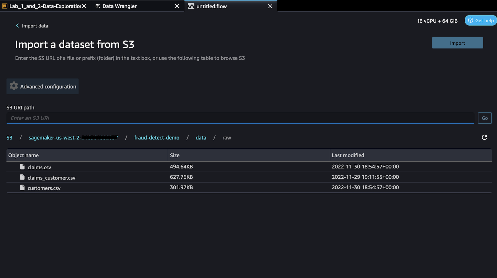
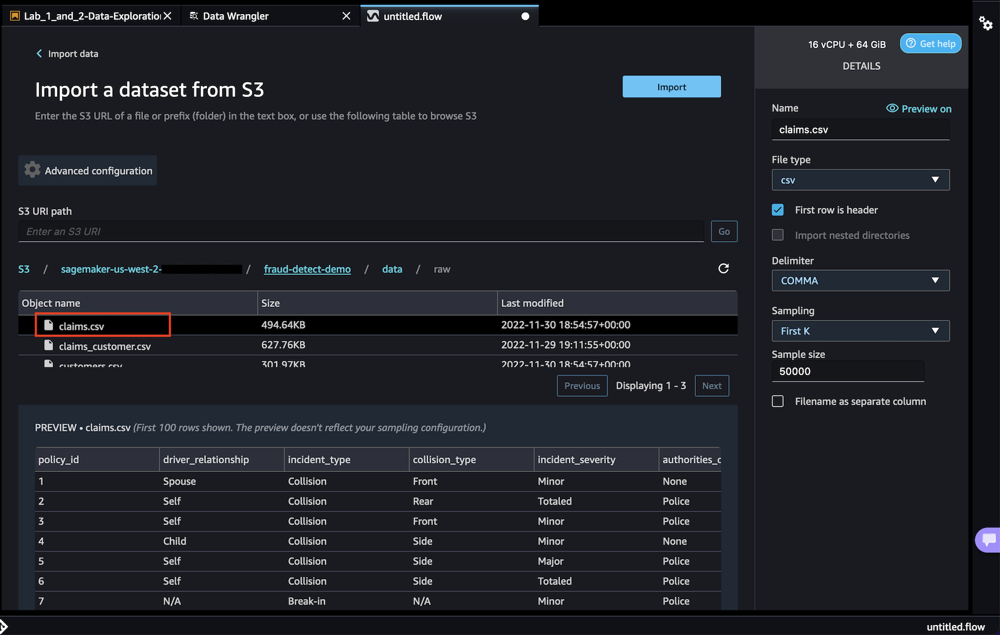
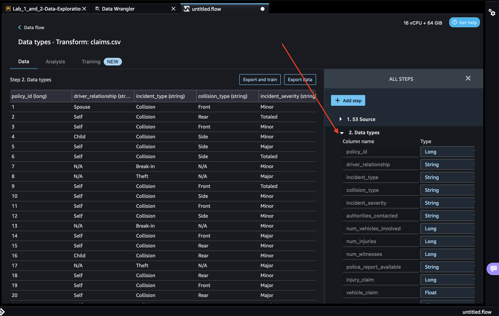
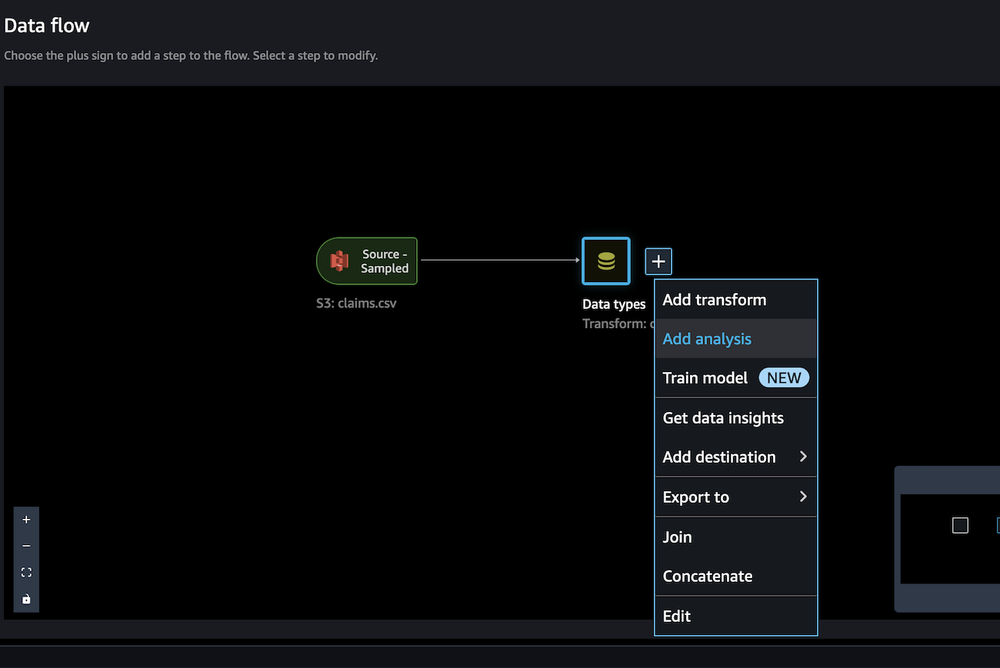
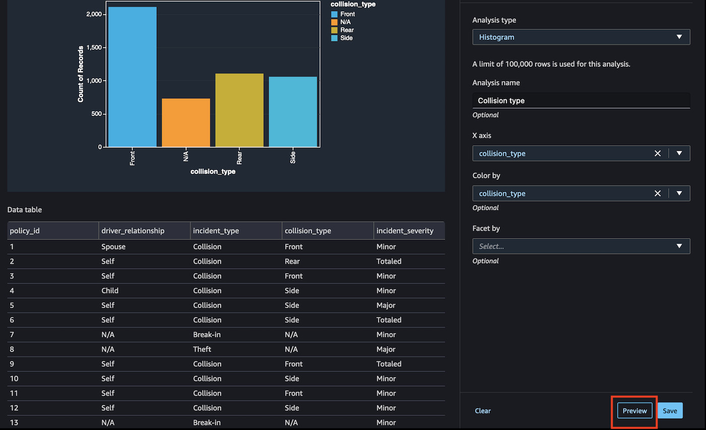
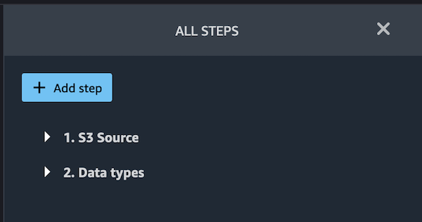
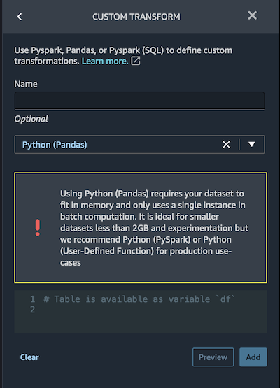
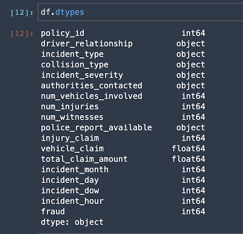

# Deploying a complete machine learning fraud detection solution using Amazon SageMaker

It’s crucial to get to market early with a minimum viable product, iterate on it as you gather feedback, and reduce overhead throughout the software development lifecycle. In this workshop, you will gain hands-on in-depth understanding of how to leverage Amazon SageMaker for your machine learning (ML) lifecycle and enhance effectiveness as a data scientist or ML engineer. We will make use of Fraud Detection as a use case and explore how to use Amazon SageMaker to transform and pre-process datasets, train and tune your ML models, audit and mitigate training bias, and run ML pipeline using automated workflows. This solution serves as a reference implementation, making it easier to implement a complete fraud detection training and inference pipeline.

- **Level:** Advanced
- **Duration:** 2 hours
- **Prerequisites:** AWS Account, Admin IAM User, Laptop with a web browser (preferably Chrome or FireFox)

## Contents
1. [Introduction](#introduction)
2. [Architecture](#architecture)
3. [Environment setup](#environmentsetup)
4. [Overview of the Environment](#overviewofenvironment)
5. [Running Jyputer Notebooks (optional)](#runningjyputernotebooks)
6. [Data Preparation](#datapreparation)
7. [Training and Deployment](#traininganddeployment)
8. [Machine Learning Workflow](#machinelearningworkflow)
9. [Summary](#summary)
10. [Cleanup](#cleanup)
11. [Bonus Material](#bonusmaterial)
12. [Troubleshooting](#troubleshooting)
13. [Additional Resources](#additionalresources)
14. [License](#license)

<a id ='introduction'> </a>
## 1. Introduction
According to the [Insurance Information Institute (III)](https://www.iii.org/article/background-on-insurance-fraud), insurance fraud is a deception committed against an insurance company for financial gain. It can be anything from lying about a garaging address (the location where your vehicle is parked for most of the year) to exaggerating or outright staging an accident. Auto-insurance fraud is illegal in all 50 states in the United States of America, and insurance companies work hard to investigate and expose fraudulent insurance claims.

The purpose of this workshop is to demonstrate how to build, train, and deploy an end-to-end Machine Learning solution that helps us detect fraudulent auto insurance claims.

The workshop can be executed by anyone who would like to know more about Machine Learning on AWS. You need basic Python skills to navigate the workshop.

Data used in this workshop is synthetically generated and consists of customer biographical data, and auto insurance claims data. On the onset, it is not ready for Machine Learning and requires transformation before it is ready for training. We will also create a Machine Learning Pipeline to automate the training, tuning and deployment stages for an automated end-to-end solution.

<a id ='architecture'> </a>
## 2. Architecture


<a id ='environmentsetup'> </a>
## 3. Environment Setup

<a id ='logininstructions'> </a>
### 3.1 Login Instructions

**Note:** Using your own AWS account to complete this workshop may incur some charges.

1. Your AWS account must have the ability to create new IAM roles and scope other IAM permissions. If you don’t have an existing AWS account with administrator level access, you need to create a new account: [Create a new AWS account](https://aws.amazon.com/getting-started/)

2. Once you have an AWS account, ensure you follow the remaining workshop steps as an IAM user with administrator access to the AWS account: [Create a new IAM user](https://console.aws.amazon.com/iam/home?#/users$new)

3. Enter the user details:

   

4. Attach the `AdministratorAccess` IAM policy:

   

5. Click to create the new user:

   

6. Take note of the login URL and save:

   

7. Log in as the new user.

8. If you instead see the following message, this means that your browser has been previously logged into another AWS account. Click the "here" link to logout of this account AWS Console, and go back to click on "Open AWS Console" button.

   

### 3.2 Launch CloudFormation Stack

1. Navigate to [AWS CloudFormation](https://console.aws.amazon.com/cloudformation/home#/stacks/create/template) (AWS Console) to create a new stack.
2. Under **Specify a template**, select **Upload a template file** and select the `fraud-detection-workshop-selfpaced.yaml` you previously downloaded and click **Next** 

   

3. Provide a name for the CloudFormation stack under **Stack name**, such as `fraud-detection-workshop`
4. Specify the name of the S3 bucket you created under **AssetsBucket**
5. Remove any value in the **AssetsBucketPrefix** parameter
6. Leave the rest of the paramters unchanged, and click **Next**
7. On the **Configure stack options** screen, scroll to the bottom and click **Next**
8. Check off the box "I acknowledge that AWS CloudFormation might create IAM resources." and click Create stack:

   
   
Note: This step will take a minutes to run and set up your workshop environment. Wait for this step to finish before you move to next step of verifying your environment.

### 3.3 Verify SageMaker Studio is ready

1. Navigate to [AWS console](https://console.aws.amazon.com/) browser window and type SageMaker in the search bar at the
   top of the AWS console home page. Click on [Amazon SageMaker](https://console.aws.amazon.com/sagemaker/home) service page in the AWS console.


2. Click on the Studio link in the left navigation pane under Control Panel.

   

3. Next, you should see a user is already setup for you. Click on "Open Studio".

   

4. This will open SageMaker Studio UI in new browser window. The Amazon SageMaker Studio UI extends the JupyterLab
   interface. Keep this window open.
   
   

Now let's walk through the various files and resources pre-provisioned for us.

<a id='overviewofenvironment'> </a>
## 4. Overview of the Environment

In this workshop we will -

- **Explore, clean, visualize and prepare the data**:  This step is all about understanding the auto insurance claims
  data.
- **Select & engineer features**: Here we will get acquainted with Amazon SageMaker Feature Store.
- **Build and train a model**: Train your model through the SageMaker API.
- **Deployment & Inference**: Learn to deploy your model through quick commands for Real-time inference.
- **(Bonus) Transform data visually**: Learn to transform and visualize data through Amazon SageMaker DataWrangler.
- **(Bonus) Detect bias in the dataset**: Learn to use Amazon SageMaker Clarify to detect bias in a bonus lab.
- **(Bonus) Batch transforms**: Learn to batch inference requests and use SageMaker Batch Transforms.
- **Finally**, put everything together into a production CI/CD pipeline using Amazon SageMaker Pipelines

We are going to make use of three core jupyter notebooks.

1. The first notebook (`Lab_1_and_2-Data-Exploration-and-Features.ipynb`) demonstrates Exploratory Data Analysis (EDA).
   Specifically, data visualization, manipulation and
   transformation through Pandas and Seaborn python libraries. It will then walk you through feature engineering and
   getting the data ready for training.

2. The second notebook (`Lab_3_and_4-Training_and_Deployment.ipynb`) demonstrates training and deployment of the model
   followed by validation of the predictions using
   a subset of the data. Once deployed, the next step shows how to get predictions from the model.

3. The third notebook (`Lab_5-Pipelines.ipynb`) showcases a pipeline which integrates all previous steps. This is a good
   example on how to operationalize a Machine Learning Model into a production pipeline. This is a stand-alone lab which
   doesn't require executing the first two notebooks.


### 4.1 Explanation of the code files

There are five notebooks in the folder `FraudDetectionWorkshop`:

| File Name                                           | Description                                 |
|-----------------------------------------------------|---------------------------------------------|
| Lab_1_and_2-Data-Exploration-and-Features.ipynb     | Notebook with Lab 1 & 2                     |
| Lab_3_and_4-Training_and_Deployment.ipynb           | Notebook with Lab 3 & 4                     |              |                                                                                                         |
| Lab_5-Pipelines.ipynb                               | Notebook with Lab 5 (SageMaker pipelines)   |
| Lab_Bonus-Batch_Transform.ipynb                     | Bonus notebook demonstrates Batch Transform |
| Lab_Bonus-Detect_bias_using_SageMaker_Clarify.ipynb | Bonus notebook demonstrates Bias detection  |

### 4.2 Explanation of the data files

The target data exists in the `data` directory. Below is a list of files and their brief description.

| File Name                  | Description                                                                                                 |
|----------------------------|-------------------------------------------------------------------------------------------------------------|
| claims_customers.csv       | Horizontally combined dataset of customer and claims dataset                                                |              |                                                                                                             |
| claims_preprocessed.csv    | Contains claims data after Data Preparation step                                                            |
| claims.csv                 | Contains all claims fraudulent and non-fraudulent                                                           |
| customers_preprocessed.csv | Contains customer data after Data Preparation step                                                          |
| customers.csv              | Contains information about the customers                                                                    |
| dataset.csv                | Contains merged dataset (claims and customers) after Data Preparation step (features ready to the training) |
| test.csv                   | Contains the data we'll use to test the model                                                               |
| train.csv                  | Contains the data we'll use to train the model                                                              |
| upsampled_data.csv         | This is the dataset pre-created after fixing the bias. Used with SageMaker Clarify                          |

### 4.3 Explanation of output files

The `outputs` directory contains two files that contain data transformations. We will use these files in Lab 5.

* claims_flow_template
* customer_flow_template

### 4.4 Explanation of helper scripts

There are seven helper scripts in `scripts` directory:

| File Name                  | Description                                                                          |
|----------------------------|--------------------------------------------------------------------------------------|
| create_dataset.py          | Create train and test datasets                                                       |
| create_feature_store.py    | Create Feature Stores, loads sampled data and waits for data to be available offline |
| demo_helpers.py            | Useful functions to delete project resources and general functions                   |
| evaluate.py                | Evaluation script for measuring model accuracy                                       |
| inference_specification.py | Defines how to perform inference generation after a training job is run              |
| lambda_deployer.py         | Lambda function that will be created on pipeline to execute model deployment         |
| xgboost_starter_script.py  | A Python script that is executed as the training entry point                         |


Note: If for some reason, you are unable to complete the workshop, please head to the [clean-up steps](/90-clean-up).
Resources created during the workshop may incur minor charges. It is best practice to spin down resources when they're
not in use.

<a id='runningjyputernotebooks'> </a>
## 5. Running Jyputer Notebooks (optional)
Note: if you already know how to execute Jupyter notebooks, skip this section.

1. When you open a notebook, you'll see a popup that requires you to select a kernel and instance type. Please make sure
   that the Image is Data Science, Kernel is Python3 and Instance Type is `ml.t3.medium` as shown in the screenshot below.

   

   **Note:** If for some reason, you see an error on capacity for this particular instance type, it's okay to scale up and
   choose the next available instance type.

2. If you haven't worked with Jupyter notebooks before, the following screenshots explains how to execute and run
   different cells.

   

   Clicking on the play button will execute the code within a selected cell.

3. If you see a * sign next to a cell, it means that cell is still being executed, and you should wait. Once it finishes
   it will show a number where the * was.

   

<a id='datapreparation'> </a>
## 6. Data Preparation
In this section, you will learn about the highlighted steps of the machine learning process.

   

The following material provides contextual information about this lab. Please read through this information before you refer jupyter notebook for step-by-step code block instructions.

### 6.1 Ingest Transform and Preprocess Data
Exploratory Data Analysis (EDA) is an unavoidable step in the Machine Learning process. Raw data cannot be consumed directly to create a model. Data stakeholders understand, visualize and manipulate data before using it. Common transforms include (but aren't limited to): removing symbols, one-hot encoding, removing outliers, and normalization.

You will be working on the first notebook in the series `Lab_1_and_2-Data-Exploration-and-Features.ipynb`. Please scroll down for important context before starting with the notebooks.

**The steps are outlined below:**

1. Data visualization ~5m
2. Data transformation ~8m

Total run time: ~13 minutes

#### 6.1.1 Data Transformation

For our use case we have been provided with two datasets `claims.csv` and `customers.csv` containing the auto-insurance
claims and customers' information respectively. This dataset was generated synthetically. However, the raw dataset can
be non-numeric which is hard to visualize and cannot be used for the Machine Learning process.

Consider the columns `driver_relationship` or `incident_type` in `claims.csv`. The data type for values under these
columns is known as an `Object`. It's a string that represents a feature. It's hard to use this kind of data directly
since machines don't understand strings or what they represent. Instead, it would be a lot easier to just mark a feature
as a one or zero.

   

So instead of saying:

```python
driver_relationship = 'Spouse'
```

It's better to break it out into another feature like so:

```python
driver_relationship_spouse = 1
```

We've elected to transform the data to get it ready for Machine Learning.

These columns will be one-hot encoded so that every type of collision can be a separate column.

   

Similarly, many transformations are required before the data can be used for Machine Learning. Data stakeholders often
iterate over datasets multiple times before they can be used. In this case, transformations are created using Amazon
SageMaker Data Wrangler (see the hint below). With this context in mind the following files are available:

1. The `.flow` templates named `customer_flow_template` and `claims_flow_template`. These templates contain the
   transformations on customer and claims dataset created through SageMaker Data Wrangler. These files are in the
   standard JSON format and can be read in using the python `json` module.
2. These transformations are applied to the raw datasets. The final processed datasets are `claims_preprocessed.csv`
   and `customers_preprocessed.csv`. **The notebook starts off with these preprocessed datasets.**

Note: If you wish to learn how to make these transformations yourself, you can go through the [Bonus Labs section of this
workshop titled - Data exploration using Amazon SageMaker Data Wrangler](/95-bonus/91-bonus-datawrangler)


#### 6.1.2 Data Visualization

At this point, let's head over to the first notebook. Navigate to the SageMaker Studio UI and click on the folder icon
on the left navigation panel. Open the folder `FraudDetectionWorkshop`. Finally, open the first notebook
titled `Lab_1_and_2-Data-Exploration-and-Features.ipynb`.


Note: Follow the instructions till you complete Lab 1 and navigate back here when done.

### 6.2 Feature Engineering
[Amazon SageMaker Feature Store](https://docs.aws.amazon.com/sagemaker/latest/dg/feature-store.html) provides a central
repository for data features with low latency (milliseconds) reads and writes. Features can be stored, retrieved,
discovered, and shared through SageMaker Feature Store for easy reuse across models and teams with secure access and
control.

SageMaker Feature Store keeps track of the metadata of stored features (e.g. feature name or version number) so that you
can query the features for the right attributes in batches or in real time
using [Amazon Athena](https://aws.amazon.com/athena/), an interactive query service.

In this lab, you will learn how to use Amazon SageMaker Feature Store to store and retrieve machine learning (ML)
features.

**The steps are outlined below:**

1. Creating the Feature Store ~6 min (including time to create and ingest data on Feature Store).
2. Visualize Feature Store ~2 min.
3. Upload data to S3 ~1 min.

Total run time ~10 minutes.

#### 6.2.1 Creating the Feature Store

The collected data, we refer to it as raw data is typically not ready to be consumed by ML Models, The data needs to
transformed e.g. encoding, dealing with missing values, outliers, aggregations. This process is known as feature
engineering and the signals that are extracted as part of this data prep are referred to as features.

A feature group is a logical grouping of features and these groups consist of features that are computed together,
related by common parameters, or are all related to the same business domain entity.

In this step, you are going to create two feature groups: `customer` and `claims`.


After the Feature Groups have been created, we can put data into each store by using
the [PutRecord API](https://docs.aws.amazon.com/sagemaker/latest/APIReference/API_feature_store_PutRecord.html). This
API can handle high TPS (Transactions Per Second) and is designed to be called concurrently by different streams. The
data from PUT requests is written to the offline store within few minutes of ingestion.

Note: It is possible to verify that the data is available offline by navigating to the S3 Bucket.

#### 6.2.2 Split the Dataset and upload to S3

Once the data is available in the offline store, it will automatically be cataloged and loaded into
an [Amazon Athena](https://aws.amazon.com/pt/athena/) table (this is done by default, but can be turned off). In order
to build our training and test datasets, you will submit a SQL query to join the Claims and Customers tables created
in Athena.

The last step in this notebook is to upload newly created datasets into S3.

At this point, let's navigate back to the first notebook (`Lab_1_and_2-Data-Exploration-and-Features.ipynb`) and scroll
down to **Lab 2: Feature Engineering**

Note: Follow the jupyter notebook instructions till you complete Lab 2 and navigate back here when done.

<a id='traininganddeployment'> </a>
## 7. Training and Deployment

In this section, you will learn about the following highlighted step of the Machine Learning process.


### 7.1 Train a model using XGBoost

In this lab, you will learn how to use [Amazon SageMaker Training Job](https://docs.aws.amazon.com/sagemaker/latest/dg/how-it-works-training.html) to build, and train the ML model. 

To train a model using SageMaker, you create a training job. The training job includes the following information:
* The URL of the Amazon Simple Storage Service (Amazon S3) bucket where you've stored the training data.
* The compute resources that you want SageMaker to use for model training. Compute resources are ML compute instances that are managed by SageMaker.
* The URL of the S3 bucket where you want to store the output of the job.
* The Amazon Elastic Container Registry path where the docker container image is stored.

For this tutorial, you will use the [XGBoost Open Source Framework](https://sagemaker.readthedocs.io/en/stable/frameworks/xgboost/xgboost.html) to train your model. This estimator is accessed via the SageMaker SDK, but mirrors the open source version of the [XGBoost Python package](https://xgboost.readthedocs.io/en/latest/python/index.html). Any functionality provided by the XGBoost Python package can be implemented in your training script. XGBoost is an extremely popular, open-source package for gradient boosted trees. It is computationally powerful, fully featured, and has been successfully used in many machine learning competitions.

**The steps are outlined below:**
1. Data handling ~1m
2. Train a model using XGBoost ~8m (including running the training code ~4m)
3. Deposit the model in SageMaker Model Registry ~3m

Total run time ~ 12 mins.

#### 7.1.1 Data handling

There are two ways to obtain the dataset:
1. Use the dataset you uploaded to Amazon S3 bucket in the previous Lab (Lab 2 - Feature Engineering). 
2. Upload the following datasets from `data` folder to Amazon S3: `train.csv`, `test.csv`

The following code upload the datasets from `data` folder to Amazon S3:


#### 7.1.2 Train a model using XGBoost

You will define SageMaker Estimator using [XGBoost Open Source Framework](https://sagemaker.readthedocs.io/en/stable/frameworks/xgboost/xgboost.html) to train your model. The following code will create the Estimator object and start the training job using `xgb_estimator.fit()` function call.


For this example, we will use the following parameters for the XGBoost estimator:
* `entry_point` - Path to the Python source file which should be executed as the entry point to training.
* `hyperparameters` - Hyperparameters that will be used for training. The hyperparameters are made accessible as a dict[str, str] to the training code on SageMaker.
* `output_path` - S3 location for saving the training result (model artifacts and output files).
* `framework_version` - XGBoost version you want to use for executing your model training code.
* `instance_type` - Type of EC2 instance to use for training.

If you want to explore the breadth of functionality offered by the SageMaker XGBoost Framework you can read about all the configuration parameters by referencing the inheriting classes. The XGBoost class inherits from the Framework class and Framework inherits from the EstimatorBase class:
* [XGBoost Estimator documentation](https://sagemaker.readthedocs.io/en/stable/frameworks/xgboost/xgboost.html#sagemaker.xgboost.estimator.XGBoost)
* [Framework documentation](https://sagemaker.readthedocs.io/en/stable/api/training/estimators.html#sagemaker.estimator.Framework)
* [EstimatorBase documentation](https://sagemaker.readthedocs.io/en/stable/api/training/estimators.html#sagemaker.estimator.EstimatorBase)

Launching a training job and storing the trained model into S3 should take ~4 minutes. Notice that the output includes the value of `Billable seconds`, which is the amount of time you will be actually charged for.


#### 7.1.3 Deposit the model in SageMaker Model Registry
After the successful training job, you can register the trained model in [SageMaker Model Registry](https://docs.aws.amazon.com/sagemaker/latest/dg/model-registry.html). SageMaker’s Model Registry is a metadata store for your machine learning models. Within the model registry, models are versioned and registered as model packages within model groups. Each model package contains an Amazon S3 URI to the model files associated with the trained model and an Amazon ECR URI that points to the container used while serving the model.

At this point, let's navigate back to the training notebook (`Lab_3_and_4-Training_and_Deployment.ipynb`) and scroll
down to **Lab 3: Prerequisites**

Note: Follow the jupyter notebook instructions till you complete Lab 3 and navigate back here when done.

### 7.2 Deploy and Serve the Model

After you train your machine learning model, you can deploy it using Amazon SageMaker to get predictions in any of the following ways, depending on your use case:

- For persistent, real-time endpoints that make one prediction at a time, use SageMaker real-time hosting services.
- Workloads that have idle periods between traffic spurts and can tolerate cold starts, use Serverless Inference.
- Requests with large payload sizes up to 1GB, long processing times, and near real-time latency requirements, use Amazon SageMaker Asynchronous Inference.
- To get predictions for an entire dataset, use SageMaker batch transform.

Following image describes different deployment options and their use cases.


**The steps are outlined below:**

- Evaluate trained model and update status in the model registry:  ~3 mins
- Model deployment: ~1 min
- Create/update endpoint: 5 mins
- Predictor interface: 1 mins

Total run time ~ 10 mins.

#### 7.2.1 Evaluate trained model
 After you create a model version, you typically want to evaluate its performance before you deploy the model in production. If it performs to your requirements, you can update the approval status of the model version to Approved. In the real-life MLOps lifecycle, a model package gets approved after evaluation by data scientists, subject matter experts, and auditors.

For the purpose of this lab, we will evaluate the model with test dataset that was created during training process. The lab contains evaluate.py script that calculates AUC (Area under the ROC Curve) on the test dataset. The AUC threshold is set at 0.7. If the test dataset AUC is below the threshold, then the approval status should be "Rejected" for that model version.

#### 7.2.2 Model deployment
To prepare the model for deployment, you will conduct following steps:
- Query the model registry and list all the model versions:

Note: For the purpose of this lab, we will get the latest version of the model from the model registry. However, you can apply different filtering criterion such as listing approved models or get specific version of the model. Please refer to the [Model Registry](https://docs.aws.amazon.com/sagemaker/latest/dg/model-registry.html) documentation.

- Define the endpoint configuration:
Specify the name of one or more models in production (variants) and the ML compute instances that you want SageMaker to launch to host each production variant.


When hosting models in production, you can configure the endpoint to elastically scale the deployed ML compute instances. For each production variant, you specify the number of ML compute instances that you want to deploy. When you specify two or more instances, SageMaker launches them in multiple Availability Zones, this ensures continuous availability. SageMaker manages deploying the instances.

#### 7.2.3 Create/update endpoint
Once you have your model and endpoint configuration, use the [CreateEndpoint API](https://docs.aws.amazon.com/sagemaker/latest/APIReference/API_CreateEndpoint.html) to create your endpoint. Provide the endpoint configuration to SageMaker. The service launches the ML compute instances and deploys the model or models as specified in the configuration. Please refer to the [documentation](https://docs.aws.amazon.com/sagemaker/latest/dg/realtime-endpoints-deployment.html).

#### 7.2.4 Predictor interface
In this part of the workshop, you will use the data from `dataset.csv` to run inference against the newly deployed endpoint.

At this point, let's navigate back to the training notebook (`Lab_3_and_4-Training_and_Deployment.ipynb`) and scroll
down to **Lab 4: Deploy and serve the model**

Note: Follow the jupyter notebook instructions till you complete Lab 4 and navigate back here when done.

<a id='machinelearningworkflow'> </a>
## 8. Machine Learning Workflow using SageMaker Pipelines

In this section, you will learn about the following highlighted step of the Machine Learning process.


Note: This lab demonstrates how to build an end-to-end machine learning workflow using Sagemaker Pipeline. This is a stand-alone lab and can be run independently of the previous labs. If you have already executed the previous labs (Lab 1 and Lab 2) then you don't need to run the Step 0 on juypter notebook.

### 8.1 Overivew

In previous labs, you built separate processes for data preparation, training, and deployment. In this lab, you will build a machine learning workflow using SageMaker Pipelines that automates end-to-end process of data preparation, model training, and model deployment to detect fraudulent automobile insurance claims.


**The steps are outlined below:**

- Step 1 - Data Wrangler Preprocessing ~2 min
- Step 2 - Create Dataset and Train/Test Split ~1 min
- Step 3 - Train XGBoost Model ~1 min
- Step 4 - Model Pre-Deployment Step ~1 min
- Step 5 - Register Model ~1 min
- Step 6 - Model deployment ~1 min
- Step 7 - Combine and Run the Pipeline Steps ~1 min
- Run the pipeline ~15 mins

Total run time ~ 23 mins.

### 8.3 Creating Automated Machine Learning Pipeline

SageMaker Pipelines service is composed of following steps. These steps define the actions that the pipeline takes and the relationships between steps using properties.

#### 8.3.2 Step 1 - Data Wrangler Preprocessing

Define Data Wrangler inputs using "ProcessingInput", outputs using "ProcessingOutput", and "Processing Step" to create a job for data processing for "claims" and "customer" data.

#### 8.3.2 Step 2 - Create Dataset and Train/Test Split

Next you will create an instance of a SKLearnProcessor processor. You can split the dataset without using SKLearnProcessor as well, but if the dataset is larger than the one provided, it will takes more time and requires local compute resources. Hence it is recommended to use manage processing job.

#### 8.3.3 Step 3 - Train XGBoost Model

You will use SageMaker's XGBoost algorithm to train the dataset using the [Estimator](https://sagemaker.readthedocs.io/en/stable/api/training/estimators.html) interface. A typical training script loads data from the input channels, configures training with hyperparameters, trains a model, and saves the model to "model_dir".

#### 8.3.4 Step 4 - Model Pre-Deployment Step

`sagemaker.model.Model` denotes a SageMaker Model that can be deployed to an Endpoint.

#### 8.3.5 Step 5 - Register Model

Typically, customers can create a ModelPackageGroup for SageMaker Pipelines so that model package versions are added for every iteration.

#### 8.3.6 Step 6 - Model deployment

Once the model is registered, the next step is deploying the model. You will use Lambda function step to deploy the model as real time endpoint. The SageMaker SDK provides a Lambda helper class that can be used to create a Lambda function. This function is provided to the Lambda step for invocation via the pipeline. Alternatively, a predefined Lambda function can also be provided to the Lambda step.

Attention: Please open [CloudFormation console](https://console.aws.amazon.com/cloudformation/home) and copy Lambda ARN from the
generated function (under the Outputs tab).


Copy lambda function ARN value and add it to cell #21


#### 8.3.7 Step 7 - Combine the Pipeline Steps

SageMaker Pipelines is a series of interconnected workflow steps that are defined using the [Pipelines SDK](https://sagemaker.readthedocs.io/en/stable/workflows/pipelines/sagemaker.workflow.pipelines.html). This Pipelines definition encodes a pipeline using a directed acyclic graph (DAG) that can be exported as a JSON
definition.

#### 8.3.8 Create the pipeline definition

Submit the pipeline definition to the SageMaker Pipelines to create a pipeline if it doesn't exist, or update the pipeline if it does.


#### 8.3.9 Review the pipeline definition

Describing the pipeline execution status ensures that it has been created and started successfully. Viewing the pipeline definition with all the string variables interpolated may help debug pipeline bugs.


#### 8.3.10 Run the pipeline

Start a pipeline execution. Note this will take about 15 minutes to complete. You can watch the progress of the Pipeline Job on your SageMaker Studio Pipelines panel.

1. Click the Home folder pointed by the arrow and click on `Pipelines`.
2. You will see the available pipelines in the table on the right.
3. Click on `FraudDetectDemo`.


Next, you will see the executions listed on the next page. Double-click on the Status `executing` to be taken to the graph representation.


You will see the nodes turn green when the corresponding steps are complete.


Note: Follow the jupyter notebook instructions till you complete Lab 5 and navigate back here when done.

<a id='summary'> </a>
## 9. Summary

### What you have learned

In this workshop, you have learned how to:

- Inspect, analyze and transform an auto insurance fraud dataset
- Ingest transformed data into SageMaker Feature Store using the SageMaker Python SDK
- Train an XGBoost model using SageMaker Training Jobs
- Create a realtime endpoint for low latency requests using SageMaker
- Integrate all previous steps into an MLOps workflow with SageMaker Pipelines

<a id='cleanup'> </a>
## 10. Clean up

To clean up resources:
- Delete the CloudFormation stack to delete the application and pipelines
- Delete lifecycle configuration by running following command in your account and region:
```
aws sagemaker delete-studio-lifecycle-config --studio-lifecycle-config-name git-clone-step
```
- Finally, go to AWS console and make sure the S3 buckets have been deleted.

<a id='bonusmaterial'> </a>
## 11. Bonus Material

This section contains bonus lab material.

### 11.1 Bonus Lab 1 - Data Exploration using Amazon SageMaker Data Wrangler

This section demonstrates the use of Amazon SageMaker Data Wrangler to visualize and transform the data. By the end of this module, you will have learned how to transform a raw dataset and how to use the resulting flow file to get a transformed dataset.

**Time estimation for reading and running the various steps**

1. Data breakdown ~5m
2. Data visualization using Data Wrangler ~8m
3. Data transformation using Data Wrangler ~10m

Total run time ~23m

#### 11.1.1 Data breakdown through Data Wrangler

We're going to use Amazon SageMaker Data Wrangler to get a first glimpse of the data. There are two datasets that are available to us. Customer data is in `customers.csv` and claims data is in `claims.csv`.

If you've already gone through Lab 1 notebook, you'll find that in cell # 26 we upload the raw data to our S3 bucket. If you haven't done so already, please go back and run the first lab till cell #26. Specifically we want to make sure the following two lines have been run

```python
s3_client.upload_file(Filename="./data/claims.csv", Bucket=bucket, Key=f"{prefix}/data/raw/claims.csv")
s3_client.upload_file(Filename="./data/customers.csv", Bucket=bucket, Key=f"{prefix}/data/raw/customers.csv")
```

Next, let's go ahead and head over to the Amazon SageMaker Studio UI

1. Click on the first `Home` icon on the left navigation bar. Next, expand the `Data` menu and click on `Data Wrangler`

   

2. If you've already gone through Lab 5 you'll find `customers.flow` and `claims.flow` already in the table. It's okay
   if these files don't exist. Click on `Import Data`.

   

3. A new flow file `untitled.flow` will be created. You can rename the file by right-clicking on the tab. Call this
   file, customer_data_exploration.flow. The Data Wrangler interface allows us to import the data from multiple sources.
   We have the option to import data from Amazon S3, Amazon Athena, Amazon EMR, Amazon Redshift and third party data
   warehouses like Snowflake and Databricks. **For our use case we will consume data from the pre-created S3 bucket**.

   

4. Select the appropriate bucket and click and double click to navigate further to `fraud-detection-demo > raw data >
   customers.csv`. If you don't see `claims_customers.csv` in the list of files, that shouldn't be a problem.

   <br /> &nbsp;

5. Next, selecting any of the files will bring up the data preview interface. This quick preview provides a snapshot of
   the first few rows of the dataset and other useful information. Click on the `claims.csv` file and then
   the `Import` button.

   <br /> &nbsp;

6. Once imported you will see a list of transforms on the right navigation pane. Expand the Data Types menu. Data
   Wrangler automatically assigns the data types to all columns based on the kind of values in the columns.

   

7. Click on the reverse caret (the button that looks like `<`) on the left of "Data Flow" and exit this screen.

   


#### 11.1.2 Data visualization using Data Wrangler

Data Wrangler offers visualization of the data instantly without writing any code.

If you wish to explore code based visualization please skip this section and go to the notebook
titled `Lab_1_and_2-Data-Exploration-and-Features.ipynb`. Lab 1 > Section 1: Ingest, Transform And Preprocess Data


The following section demonstrates quick analysis and visualization through Data Wrangler.

To get started, click on the `+` icon and Add Analysis



Here's an example of a quick analysis using Histograms. Select X axis as `months_as_customer` and the same for color by. Next
click on **Preview** to visualize the data.



Similarly play around with multiple columns and visualize the data. For more examples, open Lab 1 notebook and go
through the available visualizations.

#### 11.1.3 Data transformation using Data Wrangler

The next section demonstrates data transformation using Data Wrangler. All the transformations we make on
the data are recorded in a `.flow` file. This flow file is a specialized JSON file that is exported through Data
Wrangler. This file can be shared with other people and can be used to run transformation jobs.

If you skipped the previous section, start by creating a new flow file. Check the previous section on this page to
navigate to Data Wrangler and import the data.

1. Start by adding a new transform to the flow by clicking on the + sign and clicking on `Add transform`

   

2. Then click on Add Step

   

3. Next click on Custom Transform and select Pandas from the dropdown. Call this transform "Custom Pandas"

   


   

4. The next image shows the `dtypes` auto-identified by Pandas for all the columns. We need to convert the object types
   to lowercase

   

   The following code snippet will convert all the values in said columns to lowercase. It does that by getting the indices of the columns that have dtype `object` and then executes a `str.lower()` on every column.

   ```python
   # Table is available as variable `df`
   cat_cols = df.dtypes[df.dtypes == object].index
   df[cat_cols] = df[cat_cols].apply(lambda x: x.str.lower())
   ```

5. The next transform removes all symbols from the rows. Go ahead and add step and select `FORMAT STRING`
   from the list of transforms. Use the following in the Symbols input. Choose `driver_relationship` as the Input column

   ```
   !@#$%^&*()_+=-/\`~{}|<>?
   ```

   It should look something like this

   

6. Next repeat the process for columns `collision_type` and `incident_type`

7. Next transform we're going to do is one-hot encoding. Add step and select Encode Categorical from the list of transforms.
   We're going to start with column `driver_relationship` and transform type one-hot encode.

   

8. Repeat the above process for columns: `incident_type`, `collision_type` and `authorities_contacted`

9. Next is Ordinal encoding for columns `incident_severity` and `police_report_available`. Here is what it looks like

   

10. The next step is to add a new column called `event_time`. We'll give it the current timestamp. Go ahead and select a
    new transform like we did for the first one called Custom Transform > Pandas. Here's the code to add the new column

    ```python
    # Table is available as variable `df`
    import pandas as pd
    df['event_time'] = pd.to_datetime('now').timestamp()
    ```

11. Finally, the column `police_report_available` should be parsed from String to Long. Select `Parse column as type`

    

#### 11.1.4 Run Data Wrangler transformation job

At this point, you have completed the first transformation flow. Now we can create a Data Wrangler job to transform this
data. In order to do that click on the `+` icon after transforms once more and choose a destination.


This destination is where Data Wrangler will place the resulting .csv file. Select your S3 bucket and click open. In the
screenshot we show the resulting dataset name as `claims_dataset.csv` however this is just an example.


Click on create job button


Set job name and click on `Next, 2 - Configure job`


Choose instance type and configuration and click on create


Once the job is created it will show up under Processing jobs under the SageMaker console
(Note: SageMaker console is not the same as SageMaker Studio console).


Once the job finishes it will output the transformed file at the location you specified in the previous step.

#### 11.1.5 Challenge

Create your own transforms on the `customers.csv` file like we did for our customer dataset. Following transforms can be
applied:

1. Convert all object type dtypes to lower string
2. Drop column `customer_zip`
3. One-hot-encode `customer_gender`, `policy_state`
4. Convert the resulting columns from `customer_gender` float values to long
5. Convert the resulting columns from `policy_state` float values to long
4. Give `customer_education` objects numeric values: e.g. `below high school` would be 0. Higher the degree, higher the
   numeric value
5. Give the `policy_liability` numeric values: e.g. `15/30` would be 0, `25/50` is 1, `30/60` as 2, `100/200` as 3
6. Add a new column `event_time` to the current datetime timestamp. Check step # 10 in the previous transform
7. We can also drop `customer_gender_other` and `customer_gender_unknown`

Now run a job that transforms the `customers.csv` to `customers_dataset.csv`

### 11.2 Bonus Lab 2 - Detect bias in the training data set
In this bonus lab, we're going to explore if our dataset has any bias. Biases are imbalances in the training data or
prediction behavior of the model across different groups, such as age or income bracket. It is important to address bias
in our data before training so that the predictions aren't skewed.

We will use Amazon SageMaker Clarify to run through multiple bias-detection algorithms. This analysis is done by running
a SageMaker Clarify job. The job will give us results on imbalance according to different methodologies.

Head to the notebook titled `Lab_Bonus-Detect_bias_using_SageMaker_Clarify.ipynb`

**Time estimation for reading and running the various lab parts through Lab**

* Initial clarify job to detect bias: ~8 minutes
* Second clarify job to detect bias: ~8 minutes

Total run time ~16 minutes

#### 11.2.1 Run an initial job

Continue to follow the cells to create the variables for job output. Create `BiasConfig` and `DataConfig` objects and run a pretraining bias job. You can do it by creating an instance of the `SageMakerClarifyProcessor`

```python
clarify_processor.run_pre_training_bias(
    data_config=bias_data_config,
    data_bias_config=bias_config
    )
```

Wait for a couple of minutes while this job runs, and we'll see the output of various algorithms.


The facet `customer_gender_female` is showing signs of bias in this case. This is further confirmed from the subsequent
cells. There is a class imbalance of 0.395 for the column.


The challenge of working with imbalanced datasets is that most machine learning techniques will ignore the effects of
features from a minority class. Let's fix this

#### 11.2.2 Fix the bias

There are multiple ways to fix bias. One of the popular techniques is **SMOTE (Synthetic Minority Oversampling Technique)**.
We're employing the library `imbalanced-learn` which we installed at the beginning of the lab.

Go ahead and follow the steps to fix the imbalance. Then re-run the job

#### 11.2.3 Re-run the bias detection job

Once we re-run the job we will see the results similar to the one below


As you can see the class imbalance has now been reduced to 0. You have identified and mitigated bias in training dataset.

### 11.3 Batch Transform for on-demand inference

This notebook provides an introduction to the Amazon SageMaker batch transform functionality. If the goal is to generate predictions from a trained
model on a large dataset where minimizing latency isn't a concern, then the batch transform functionality may be easier, more scalable, and more 
appropriate. This can be especially useful for cases like:

- Preprocess datasets to remove noise or bias that interferes with training or inference from your dataset.
- Get inferences from large datasets.
- Run inference when you don't need a persistent endpoint.
- Associate input records with inferences to assist the interpretation of results.

In this lab, we will use the model created in Lab 4 for batch scoring. As part of this lab, you will perform following steps.

- Prepare data input for Batch Transform ~ 1 min
- Create and run Batch transform job ~ 7 mins
- Read prediction results from the Batch Transform jobs. ~ 1 min

Total run time ~9 mins

#### 11.3.1 Prepare data input for Batch Transform
For the purpose of this lab, we will use raw test dataset for batch prediction. We will remove the predicted column, as well as, index and header row. The data will be saved back to S3

#### 11.3.2 Create and run Batch Transform job

In this section, we will use [Amazon SageMaker API - CreateTranformJob](https://docs.aws.amazon.com/sagemaker/latest/APIReference/API_CreateTransformJob.html) to start batch scoring. In the request body, you provide the following:

- TransformJobName - Identifies the transform job. The name must be unique within an AWS Region in an AWS account.
- ModelName - Identifies the model to use.
- TransformInput - Describes the dataset to be transformed and the Amazon S3 location where it is stored.
- TransformOutput - Identifies the Amazon S3 location where you want Amazon SageMaker to save the results from the transform job.
- TransformResources - Identifies the ML compute instances for the transform job.


Please refer to the [documentation](https://docs.aws.amazon.com/sagemaker/latest/APIReference/API_CreateTransformJob.html) for further details.

#### 11.3.3 Read prediction results from the Batch Transform jobs
The output of the transformer job is stored in the S3 location defined in the TransformOutput attribute. We have fairly small dataset so we have included all the attributes while making predictions. When making predictions on a large dataset, you can exclude attributes that aren't needed for prediction. After the predictions have been made, you can associate some of the excluded attributes with those predictions or with other input data in your report. By using batch transform to perform these data processing steps, you can often eliminate additional preprocessing or postprocessing.
Please refer to the [documentation](https://docs.aws.amazon.com/sagemaker/latest/dg/batch-transform-data-processing.html) for further details.

<a id='troubleshooting'> </a>
## 12. Troubleshooting

A couple of known issues have been documented in the section below. If you encounter a new issue that has not been
documented, please reach out to AWS support staff.

### 12.1 Pandas version conflict

The prescribed version of the Pandas library is 1.1.5. In certain cases there can be a conflict when the library version
gets upgraded to 1.3.5 (or some other version).

It's best to force install Pandas==1.1.5. Cell #1 in the first notebook (`Lab_1_and_2-Data-Exploration-and-Features.ipynb`)  explicitly does this. But in rare cases an
incorrect pandas version is installed please re-run `cell #1`.

Once you've done this, restart the kernel and run till selected cell or restart kernel and clear all outputs


To check what version of pandas is installed paste the following code in any cell after cell #1

```python
import pandas as pd
pd.__version__
```

### 12.2 Data doesn't exist in the S3 bucket

In rare cases, you may encounter an error on Data Wrangler or Machine Learning Pipelines where the raw dataset may not
exist in the S3 bucket. The raw dataset is available to you under the data folder in the project repository in SageMaker
studio UI. We can remedy this by uploading the data ourselves.

In any of the cells after the `s3_client` has been defined add a new cell by clicking on the `+` button. This is already
done for you once in the first notebook `Lab_1_and_2-Data-Exploration-and-Features.ipynb` under `cell #25-2`

```python
# this will upload claims.csv to data/raw in the bucket
s3_client.upload_file(Filename="./data/claims.csv", Bucket=bucket, Key=f"{prefix}/data/raw/claims.csv")

# this will upload customers.csv to data/raw in the bucket
s3_client.upload_file(Filename="./data/customers.csv", Bucket=bucket, Key=f"{prefix}/data/raw/customers.csv")
```

<a id = 'additionalresources'> </a>
## 13. Additional Resources

### 13.1 Amazon SageMaker related resources

* [Amazon SageMaker](https://aws.amazon.com/sagemaker/)
* [Amazon SageMaker Studio](https://aws.amazon.com/sagemaker/studio/)
* [Amazon SageMaker Notebooks](https://aws.amazon.com/sagemaker/notebooks/)
* [Amazon SageMaker Data Wrangler](https://aws.amazon.com/sagemaker/data-wrangler/)
* [Amazon SageMaker Feature Store](https://aws.amazon.com/sagemaker/feature-store/)
* [Amazon SageMaker Model Training](https://aws.amazon.com/sagemaker/train/)
* [Amazon SageMaker Realtime Inference](https://docs.aws.amazon.com/sagemaker/latest/dg/realtime-endpoints.html)
* [Amazon SageMaker Model Deployment Best Practices](https://docs.aws.amazon.com/sagemaker/latest/dg/deployment-best-practices.html)
* [Amazon SageMaker Pipelines](https://aws.amazon.com/sagemaker/pipelines/)
* [Amazon SageMaker Clarify](https://aws.amazon.com/sagemaker/clarify/)


### 13.2 Other resources

* [Amazon Simple Storage Service (S3)](https://aws.amazon.com/s3/)
* [Amazon Athena](https://aws.amazon.com/athena/)
* [AWS Identity and Access Management (IAM)](https://aws.amazon.com/iam/)
* [AWS Lambda](https://aws.amazon.com/lambda/)

### 13.3 AWS code examples

* [AWS Samples on GitHub](https://github.com/aws-samples)

<a id = 'license'> </a>
## 14. License

This library is licensed under the MIT-0 License. See the [LICENSE](LICENSE) file.
